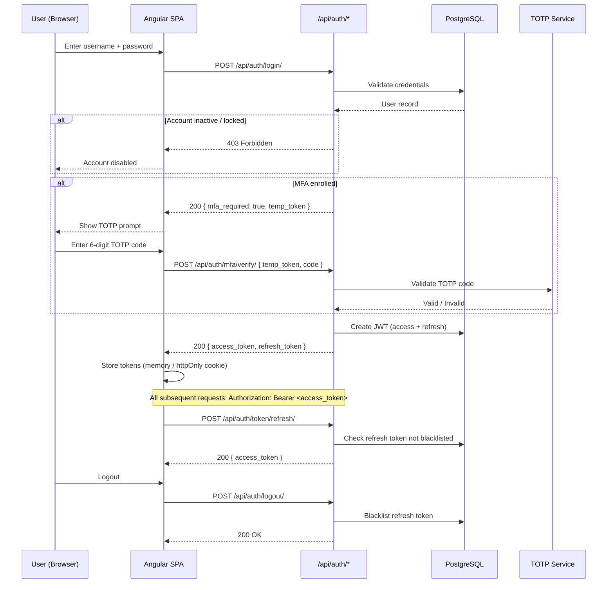
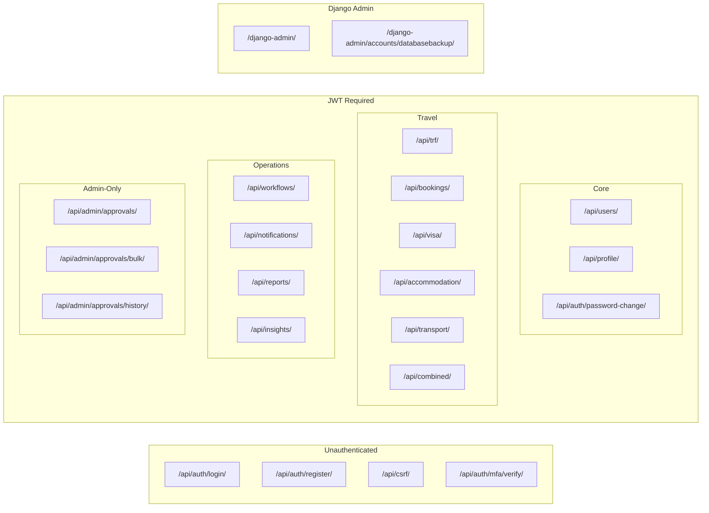
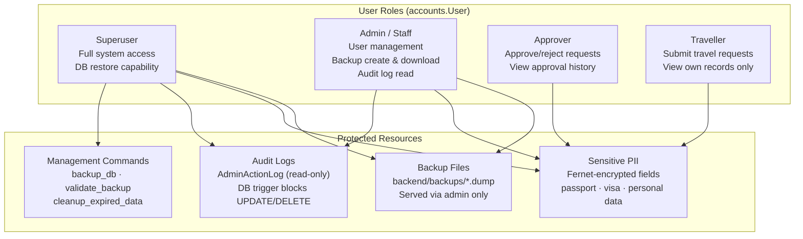
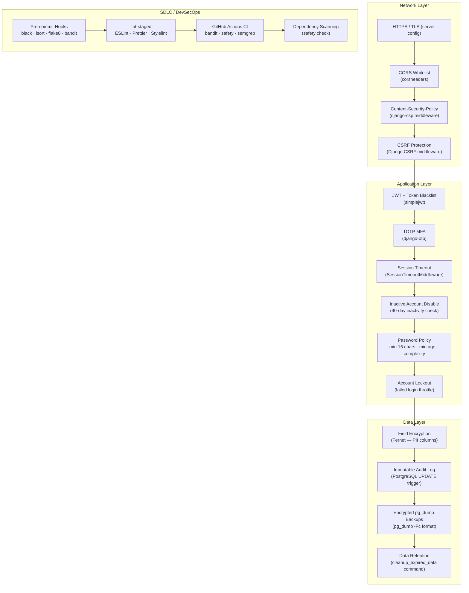
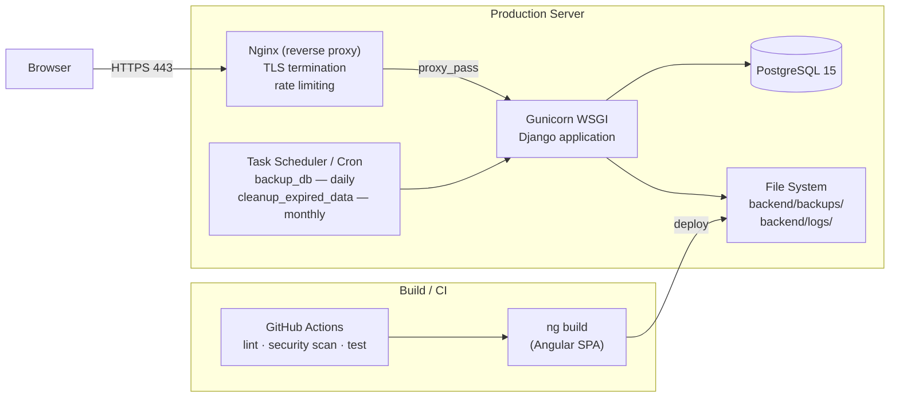
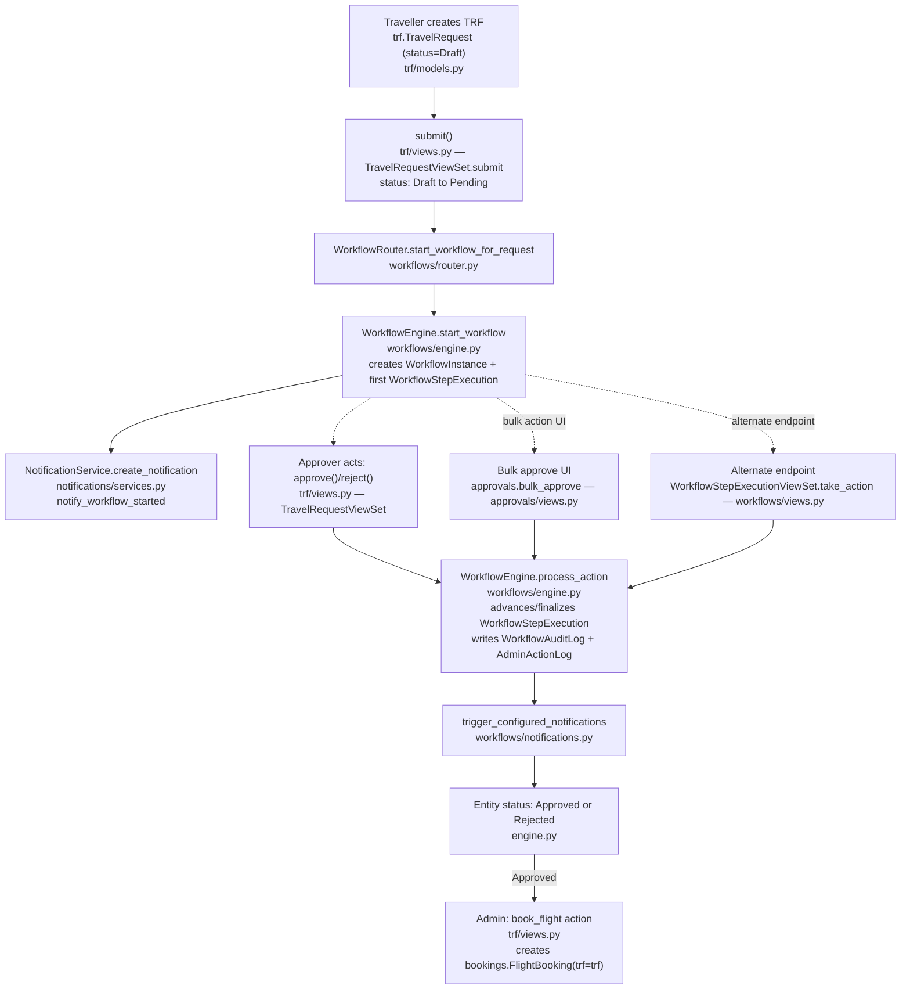

# TMS Application Architecture

Travel Management System — architecture reference for CTRL-1192.

---

## 1. System Overview

---

## 2. Authentication & MFA Flow

---

## 3. API Module Structure

---

## 4. RBAC Model

---

## 5. Security Controls Stack

---

## 6. Deployment Topology

---

## 7. Travel Request Data Flow

Traces how a single `TravelRequest` (TRF) moves through the system from creation to a booked outcome. `combined_request` runs the same pattern independently for multi-modal requests (its own `CombinedRequest` model inlines travel/visa/accommodation/transport fields rather than creating child records).

All three entry points (single-item `approve`/`reject`, `bulk_approve`, `take_action`) now converge on `WorkflowEngine.process_action` as of 2026-07-22 — see `docs/APPROVAL_WORKFLOW_FIX_ROADMAP.md` for the fix history. `bulk_approve` additionally writes its own bulk-specific `AdminActionLog` entry (`workflow_bulk_approve`/`workflow_bulk_reject`) alongside the per-step entry `process_action` writes, to record that the action came from the bulk UI. `take_action`'s `delegate` branch is the one remaining exception — it's intentionally *not* routed through `WorkflowEngine.delegate_step`, because that method requires the acting user to be the step's current assignee, whereas `take_action` allows a workflow admin to delegate on someone else's behalf; consolidating it would have silently removed that admin capability.

**Resolved (2026-07-22):**

- ~~Three divergent "approve a step" code paths~~ — consolidated onto `WorkflowEngine.process_action` (see diagram above).
- ~~Audit logging gap~~ — `WorkflowEngine.process_action` now writes an `AdminActionLog` entry for every approval path, not just bulk.
- ~~Dead signal handler~~ — deleted. This turned out to be systemic, not TRF-specific: `accommodation/signals.py`, `transport/signals.py`, and `visa/signals.py` had the identical dead pattern and were removed too.
- `approvals` app having no models is now called out directly in its module docstring and in the `APR` node label in §1 — not a bug, just previously under-documented.

**Still open, by design:**

- **Downstream requests are not auto-created on approval** — bookings, visa, accommodation, and transport records are still submitted independently by the traveller/admin after TRF approval; the only system-linked exception is the manual `book_flight` admin action. This wasn't fixed because it's a product decision (what should get prefilled, who owns the resulting draft, does the traveller review before submit), not a bug — see Fix 4 in `docs/APPROVAL_WORKFLOW_FIX_ROADMAP.md`.

---

## 8. Key Dependencies

| Layer | Package | Purpose |
|---|---|---|
| Frontend | Angular 19 | SPA framework |
| Frontend | Angular Material 19 | UI components |
| Frontend | ng-bootstrap 18 | Bootstrap integration |
| Backend | Django 5 | Web framework |
| Backend | djangorestframework | REST API |
| Backend | simplejwt | JWT auth + blacklist |
| Backend | django-otp | TOTP MFA |
| Backend | cryptography (Fernet) | Field-level encryption |
| Backend | corsheaders | CORS |
| Backend | django-csp | Content-Security-Policy |
| Backend | drf-spectacular | OpenAPI schema |
| Backend | whitenoise | Static file serving |
| Backend | psycopg2 | PostgreSQL driver |
| Database | PostgreSQL 15 | Primary datastore |
| DevSecOps | black + isort | Python formatting |
| DevSecOps | flake8 | Python linting |
| DevSecOps | bandit | Python security scan |
| DevSecOps | ESLint + Prettier | TypeScript/HTML quality |
| DevSecOps | pre-commit | Git hook runner |
| DevSecOps | Husky + lint-staged | Frontend git hooks |
