# TMS Application Architecture

Travel Management System — architecture reference for CTRL-1192.

---

## 1. System Overview

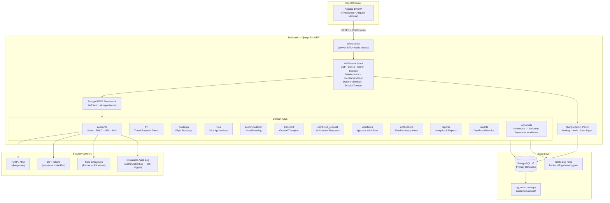

---

## 2. Authentication & MFA Flow

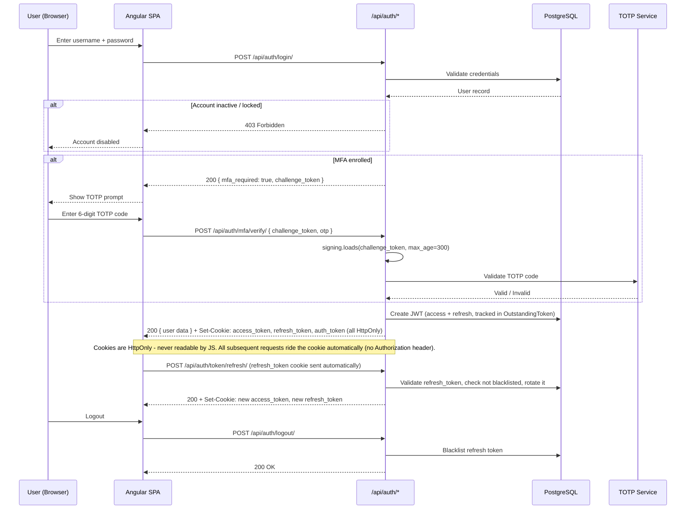

**MFA challenge token mechanism** (the diagram's `challenge_token` above — named `temp_token` in an earlier draft of this doc, which caused confusion about whether it was actually specified anywhere):

- **Not server-side state.** `LoginView` (`accounts/views.py:125`) issues it via `django.core.signing.dumps({"user_id": ...}, salt="mfa-login-challenge")` — a stateless, HMAC-signed token keyed off `SECRET_KEY`. No Redis/cache/DB row is created for it; there's nothing to clean up or for storage capacity to run out of.
- **Expiry:** `MFAVerifyView` (`accounts/views.py:1507`) decodes it via `signing.loads(challenge_token, salt="mfa-login-challenge", max_age=300)` — a hard 5-minute TTL enforced server-side; an expired token raises `SignatureExpired` and is rejected with 401.
- **Tamper protection:** the signature is verified on every decode; a modified or forged token raises `BadSignature` and is rejected with 401. `MFAVerifyView` also re-checks `user.mfa_enabled`/`user.mfa_secret` server-side before accepting an OTP, so the token alone (even genuine) can't grant access without a currently-valid MFA-enrolled account.
- **Client-side storage:** the Angular `AuthService` (`core/services/auth.service.ts`) holds it in a private in-memory field only — never written to `localStorage`/`sessionStorage` — and clears it to `null` immediately after a verification attempt. It's returned in the login response JSON body, not a cookie, since it isn't a session credential (it grants no access by itself).
- **Not single-use.** It's a stateless signed token, so nothing server-side tracks whether it's already been consumed — the same `challenge_token` could be replayed with different OTP guesses within its 5-minute window. Mitigated in practice by `MFAVerifyView`'s rate limit (5/min/IP) and TOTP's own `valid_window=1`, but this is a real (low-severity) gap relative to a true single-use/nonce design, noted here rather than fixed, since the current design's actual risk is low.

---

## 3. API Module Structure

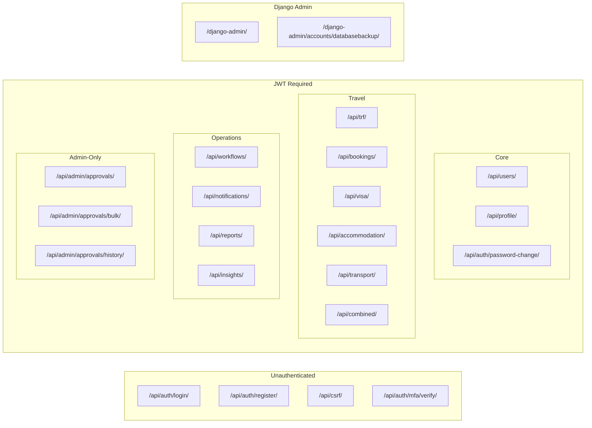

---

## 4. RBAC Model

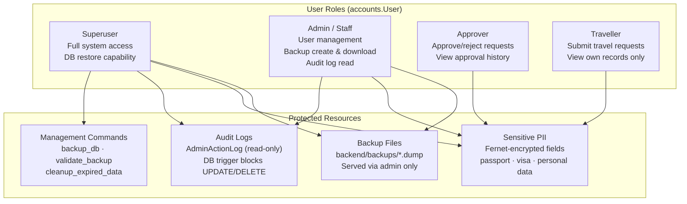

This diagram simplifies to 4 abstract role categories for readability — the real system is more granular: `accounts.Role` ↔ `accounts.Permission` via a `RolePermission` join table, 57 named permissions as of 2026-07-23 (down from 65 earlier the same day — Fix 9 deleted 7: 5 duplicates consolidated into existing permissions, plus `access_debug_endpoints`/`manage_document_templates` as dead code) (`approve_trf`, `manage_bookings`, `view_all_visa`, etc.), checked via helpers in `accounts/utils.py` (`has_permission`, `can_approve`, `can_view_all`, `can_manage`, `is_module_admin`).

**Permission-system audit history (2026-07-23/24, see `docs/APP_WIDE_GAPS_FIX_ROADMAP.md` Fixes 5-6, 9, 15):**
- ~~5 orphaned `combined_request` permissions~~ — `approve_combined`, `manage_combined_requests`, `process_combined_requests`, `view_admin_combined`, `view_all_combined` had **0 roles assigned**. Fixed (Fix 6, migration `0037`): `approve_combined` now follows the identical pattern used by `approve_trf`/`approve_visa`/`approve_transport`/`approve_accommodation` (`Department Focal`, `Line Manager`, `HOD`, `System Administrator`); the other 4 go to `System Administrator` only, since there's no single existing "combined admin" role the way each other module has one.
- ~~~14 "paper" permissions never enforced anywhere in backend code~~ — Fixed (Fix 9, migration `0038`). Re-investigated after direct pushback that "deliberately not wired" was treating a live gap as a design choice: `accounts/views.py`'s `change_role` admin action confirmed the `Registered User` → promoted-role pattern is real and intentional, not a reason to leave enforcement off. `create_trf`/`create_visa`/`create_transport`/`create_accommodation`/`create_combined` and `manage_own_profile` are now enforced on their respective create/update endpoints. 5 of the 14 (`manage_flights`, `process_flights`, `process_visa_applications`, `manage_transport_requests`, `manage_accommodation_bookings`) turned out to be duplicates of already-enforced permissions under different names — consolidated and deleted rather than wired in separately (`Ticketing Clerk` folded into `manage_bookings`/`process_bookings`, the one real gap among them). `create_combined`'s inverted assignment (only `Registered User` had it) was corrected to match `create_trf`'s role set. `export_data` is now enforced on `reports/views.py`'s admin-reports gate alongside `generate_admin_reports`. `access_debug_endpoints` and `manage_document_templates` corresponded to no endpoint anywhere in the codebase and were deleted as dead permissions.
- ~~`is_superuser` bypass missing/inconsistent across permission checks~~ — Fixed (Fix 15). `notifications.CanManageNotifications` had no `is_superuser` bypass at all (the only custom `BasePermission` subclass missing it — `accounts/permissions.py`'s 3 classes already had it). `trf`/`visa`/`transport`/`combined_request`'s `get_queryset()` were missing it in their `retrieve`/`admin_view` `can_view_all(...)` checks. `accommodation/views.py` used a separate hand-rolled `user.is_admin` boolean instead of `is_superuser` — the same anti-pattern Fix 5 removed elsewhere, missed here. All fixed to the standard `is_superuser or <permission-check>` convention used everywhere else in this codebase.

---

## 5. Security Controls Stack

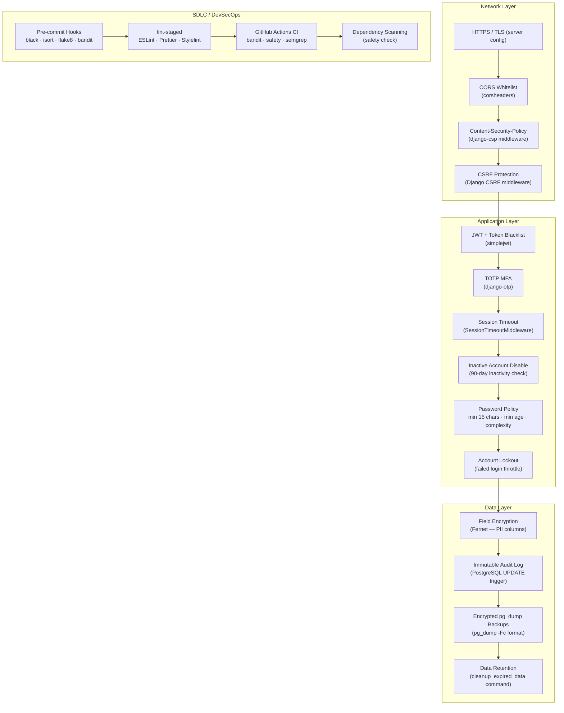

---

## 6. Deployment Topology

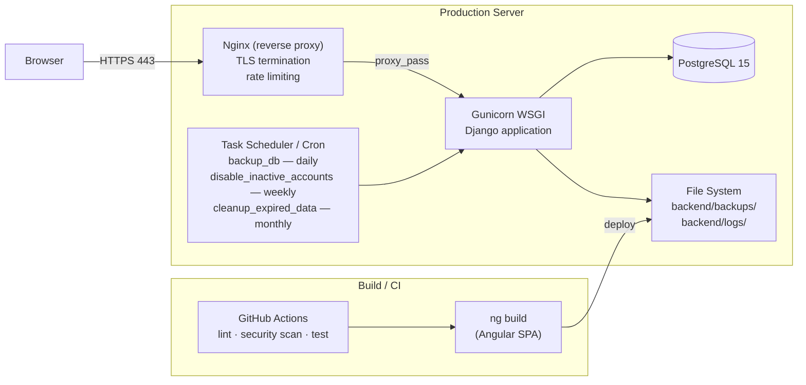

The three `CRON` jobs above are real, tested Django management commands (`backend/accounts/management/commands/`). `python manage.py install_cron` (added 2026-07-23, same app) installs the schedule shown here directly into the current user's crontab — idempotent (re-running updates rather than duplicates the entries, via a comment tag) and safe to re-run after re-deploying the repo. `backend/scripts/crontab.example` still documents the exact schedule as a manual fallback (`crontab backend/scripts/crontab.example`, paths adjusted) for hosts where running Django management commands directly isn't an option. Installing either still has to happen once per deployment host — a code commit can't reach into the host's crontab on its own — but the previous state (`crontab.example` was the *only* path, requiring a manual copy-paste an operator could simply forget) is closed.

---

## 7. Application-Wide Data Flows

This section maps how data moves through **every** domain app, not just the request/approval apps. It's organized as a bird's-eye map first, then a focused drill-down per subsystem. What's already covered elsewhere is not repeated here: authentication/MFA (§2), the API surface (§3), RBAC (§4), the security controls stack (§5), and deployment (§6).

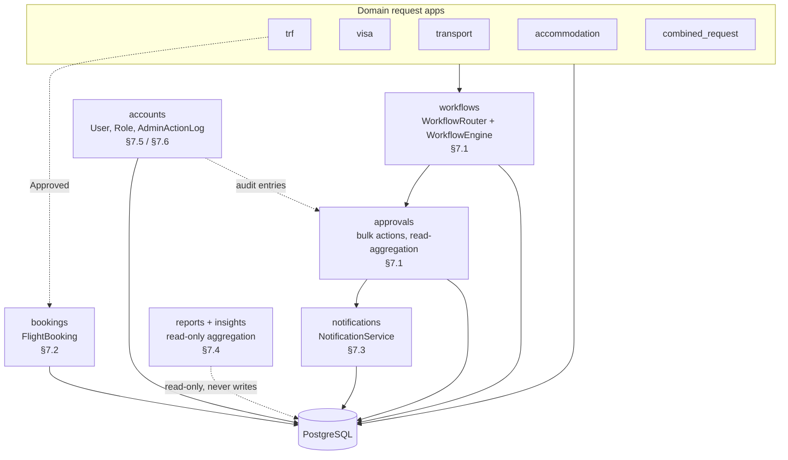

`core/` is not a domain app in its own right — it's a single shared utility (`email_settings_loader.py`) that loads SMTP configuration from the `ApplicationSetting` table into Django settings at runtime, used by the notifications pipeline (§7.3). It has no models, views, or migrations of its own.

**Why only `trf -.-> bookings` is drawn here:** this is a bird's-eye, app-to-app diagram, so an edge only appears when one app's action creates or touches a record in a *different* app. All five domain apps have their own manual, admin-triggered "fulfill an approved request" action — `trf`'s `book_flight`, `accommodation`'s `assign`, `transport`'s `complete`, `visa`'s `complete`, `combined_request`'s `process_module` (see §7.2 for `book_flight` specifically) — none of them are automatic on approval, all five are equally "not the default path, fires only under a specific admin action." `trf` is the only one of the five where that action writes into a *separate* app: `book_flight` creates a `FlightBooking` row in `bookings`, a different Django app entirely. `accommodation`'s `assign` creates an `AccommodationBooking` — but that model lives in `accommodation/models.py` itself, same app. `transport`'s `complete` can create a `VehicleAssignment` — also defined in `transport/models.py`, same app. `visa`'s `complete` and `combined_request`'s `process_module` don't create a new record at all, they just mutate the request's own fields. So the dotted `trf -.-> bookings` edge isn't marking TRF as uniquely having a manual post-approval step — every app has one — it's marking TRF as the only one whose post-approval step crosses an app boundary, which is the only kind of edge this particular diagram draws.

### 7.1 Request Submission & Approval

This is the one recurring data flow that spans five separate domain apps: **`trf`, `visa`, `transport`, `accommodation`, and `combined_request` all submit through the identical create → submit → workflow → approve/reject pipeline**, via the same shared `workflows` components (`WorkflowRouter`, `WorkflowEngine`) and the same `approvals`/notification layers. TRF was traced first because it was the app under investigation at the time, but the pattern below is generic and verified against all five apps' `views.py`, not just TRF's.

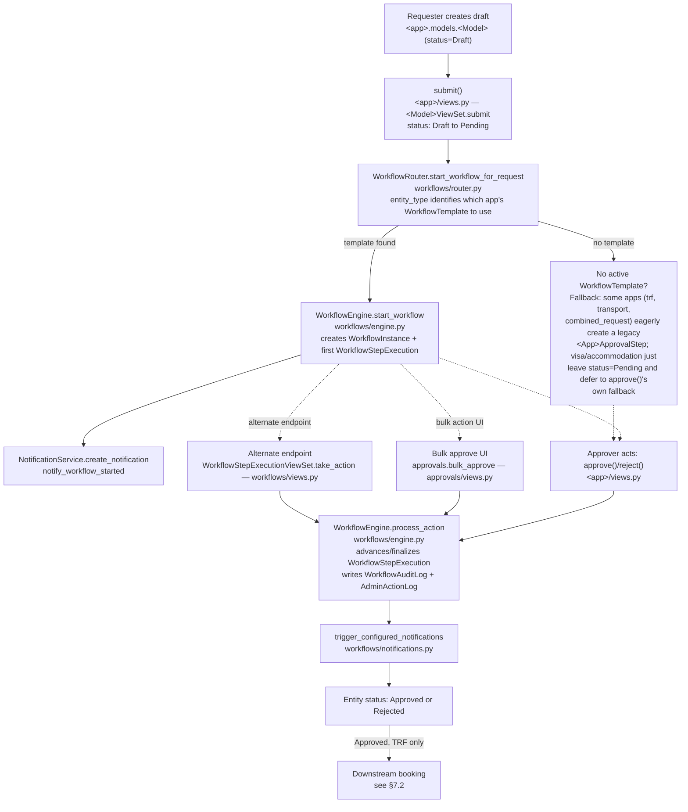

**Per-app reference:**

| App | Model | `entity_type` string | Legacy fallback model |
|---|---|---|---|
| `trf` | `TravelRequest` | `travelrequest` | `TrfApprovalStep` (created eagerly at submit) |
| `visa` | `VisaApplication` | `visaapplication` | `VisaApprovalStep` (created lazily, at approve time) |
| `transport` | `TransportRequest` | `transportrequest` | `TransportApprovalStep` (created eagerly at submit) |
| `accommodation` | `AccommodationRequest` | `accommodation` | none — status just stays `Pending` if no template |
| `combined_request` | `CombinedRequest` | `combinedrequest` | `CombinedRequestApprovalStep` (created eagerly at submit) |

`combined_request` is the multi-modal variant: its `CombinedRequest` model inlines travel/visa/accommodation/transport fields directly (with per-module inclusion flags and per-module status fields) rather than creating child records in the other four apps — but it runs through this exact same `WorkflowRouter`/`WorkflowEngine` pipeline as its own independent workflow.

All three approval entry points (single-item `approve`/`reject`, `bulk_approve`, `take_action`) converge on `WorkflowEngine.process_action` as of 2026-07-22 — see `docs/APPROVAL_WORKFLOW_FIX_ROADMAP.md` for the fix history — and this applies uniformly across all five apps, since `bulk_approve`'s `type_model_map` already covers `trf`, `transport`, `visa`, `accommodation`, and `combined`. `bulk_approve` additionally writes its own bulk-specific `AdminActionLog` entry (`workflow_bulk_approve`/`workflow_bulk_reject`) alongside the per-step entry `process_action` writes, to record that the action came from the bulk UI. `take_action`'s `delegate` branch is the one remaining exception — it's intentionally *not* routed through `WorkflowEngine.delegate_step`, because that method requires the acting user to be the step's current assignee, whereas `take_action` allows a workflow admin to delegate on someone else's behalf; consolidating it would have silently removed that admin capability.

**Resolved (2026-07-22):**

- ~~Three divergent "approve a step" code paths~~ — consolidated onto `WorkflowEngine.process_action`, application-wide (see diagram above).
- ~~Audit logging gap~~ — `WorkflowEngine.process_action` now writes an `AdminActionLog` entry for every approval path, not just bulk.
- ~~Dead signal handler~~ — deleted across all four apps that had it: `trf`, `accommodation`, `transport`, `visa` (`combined_request` never had this dead pattern).
- `approvals` app having no models is now called out directly in its module docstring and in the `APR` node label in §1 — not a bug, just previously under-documented.
- ~~Legacy-fallback authorization gap~~ (found 2026-07-22 while auditing the "no template" branch above) — when no active `WorkflowTemplate` exists for an entity type, all five apps' `approve()`/`reject()` fell back to legacy status-mutation logic gated only by `IsAuthenticated`, with no role/permission check — any authenticated user could approve or reject, regardless of role. `combined_request`'s fallback was the worst: no status-transition check either. Fixed by adding an `accounts.utils.can_approve(user, module)` check (the same permission model backing `WorkflowEngine._is_user_authorized`) to all 10 fallback branches, and wiring `'combined'` → `approve_combined` into `can_approve()`, which existed as a real permission but wasn't in that helper's module map. See `docs/APP_WIDE_GAPS_FIX_ROADMAP.md` Fix 4.
- ~~Legacy-fallback branches wrote no audit trail~~ (found 2026-07-23, follow-up to the item above: the permission check was fixed, but none of the 10 fallback branches called `AdminActionLog.log_action()` — audit logging only happened inside `WorkflowEngine.process_action`, the real-template path. `accommodation` was the worst of the five here too: unlike `trf`/`visa`/`transport`/`combined_request`, it has no `ApprovalStep`-equivalent model at all, so its fallback path left literally no record of who approved/rejected a request, or when.) Fixed by adding an `AdminActionLog.log_action(action_type="workflow_step_approved"/"workflow_step_rejected", ...)` call to all 10 fallback branches, matching the `action_type` values `WorkflowEngine.process_action` already uses. See `docs/APP_WIDE_GAPS_FIX_ROADMAP.md` Fix 12.
- ~~TRF's approval steps couldn't be skipped, unlike every other request type~~ (found 2026-07-23: `WorkflowStep.can_skip` — which controls whether the shared `ApproverSelectionComponent` shows a "Skip this approver" option — was `False` for both of TRF's active steps, while `accommodation`/`transportrequest`/`visaapplication`/`combinedrequest` all had it `True` on every step. Not a frontend bug: the same component renders identically for all 5 apps, purely reflecting this backend data. Migration `0009_enable_can_skip_for_all_steps` originally set this `True` everywhere, and `0011_fix_combined_request_can_skip` already had to re-apply it once for `combinedrequest` after its steps drifted back to `False` — TRF drifting the same way is the same class of regression, not a new one.) Fixed via `workflows/migrations/0012_fix_travelrequest_can_skip.py`, matching `0011`'s pattern exactly.
- ~~"Downstream requests are not auto-created on approval"~~ — previously listed here as a deferred product decision (bookings/visa/accommodation/transport records are submitted independently after TRF approval, no auto-creation). Re-examined 2026-07-23: confirmed with the user this isn't needed — closing as a settled "no" rather than an open item. While checking for evidence this was ever planned, found `frontend/src/app/features/requests/travel/travel-request-wizard.component.ts` — an orphaned, unreachable TRF form (not in `app.routes.ts`, called no backend endpoint, field names didn't match the real `TravelRequest` model) with "Requires Accommodation"/"Requires Local Transport" checkboxes that never did anything even when presumably in use. Removed as dead code rather than kept as a stale signal of intent — the real, connected TRF form (`trf-management`) has no such fields at all, confirming the current design deliberately doesn't do this.

### 7.2 Downstream Fulfillment (Flight, Accommodation, Vehicle)

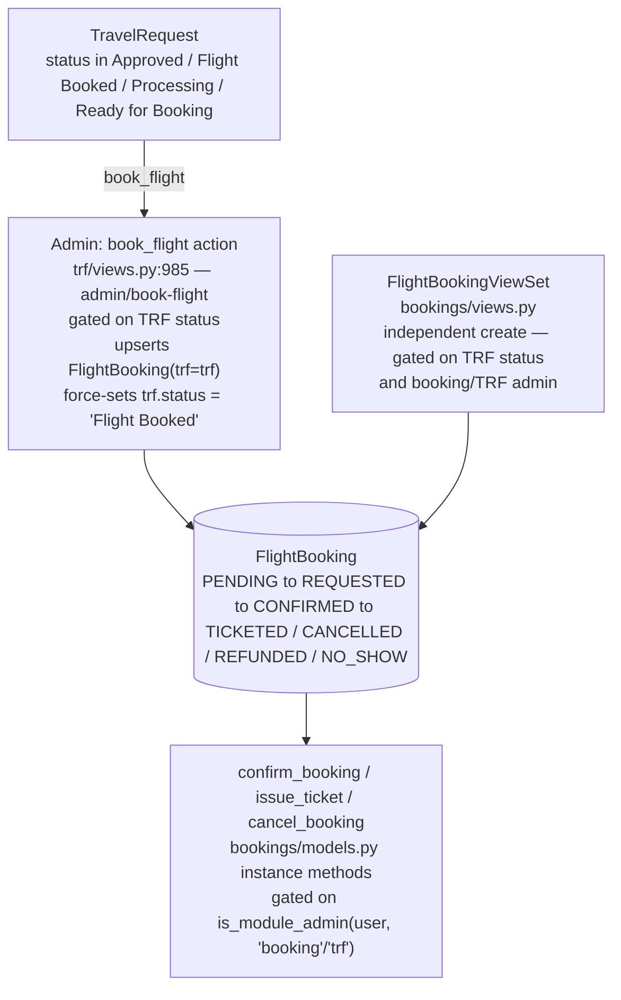

Hotel/accommodation needs are handled entirely by the `accommodation` app (staff houses, `AccommodationRequest` — see §1), not by `bookings`. This wasn't always documented correctly:

- ~~`bookings.HotelBooking` model, `HotelBookingViewSet`, and a `book_hotel` permission-check reference with no implementing action~~ — **removed 2026-07-23** (`docs/APP_WIDE_GAPS_FIX_ROADMAP.md` Fix 10). `HotelBooking` had a `trf` ForeignKey (so an earlier draft of this doc claiming "no TRF-approval linkage at all" was wrong), but the model had **0 rows ever created** and its ViewSet/serializers/frontend service methods (`createHotelBooking`, `getAllHotelBookings`, etc.) had **0 real callers** — confirmed via DB query and a full frontend grep before touching anything, same standard as the `insights` cleanup (§7.4). Removed the model, ViewSet, serializers, URL registration, admin registration, the dead `book_hotel` action-name reference and unreachable `'Hotel Booked'` status in `trf/views.py`/`utils/constants.py`, the now-always-zero hotel cost/count terms in `reports`/`insights`, and the dead frontend interfaces/methods.
- ~~Gap: `bookings`' own create endpoint wasn't gated on TRF status or caller identity~~ — **fixed 2026-07-23** (`docs/APP_WIDE_GAPS_FIX_ROADMAP.md` Fix 1 for the status check, Fix 8 for the authorization check). `FlightBookingCreateSerializer.validate_trf` now checks `BOOKABLE_STATUSES`, and `FlightBookingViewSet.perform_create` now rejects anyone who isn't a superuser or booking/TRF admin — booking is an admin/travel-desk function throughout this app (matching `book_flight`'s own `admin/book-flight` naming), confirmed via the frontend: every real caller of booking creation lives under `features/admin/flights/`, no self-service booking UI exists anywhere.

**`accommodation.AccommodationBooking`** — a real, actively-used model (`accommodation/models.py:62`), *distinct* from `AccommodationRequest`. `AccommodationRequest` is the traveller's request; `AccommodationBooking` is the actual room/date fulfillment record created against it. The `assign` action (`accommodation/views.py:1260`, `POST` detail action) takes a `staff_house`/`room`/date range, creates one `AccommodationBooking` row per night (FK to `AccommodationStaffHouse`, `AccommodationRoom`, and the originating `AccommodationRequest` via `related_name='bookings'`), and sets `AccommodationRequest.status = 'Accommodation Assigned'`. Routed at `/api/accommodation/bookings/` (`AccommodationBookingViewSet`, `accommodation/urls.py`). **21 rows in this environment** — actively used, not dormant.

**`transport.VehicleAssignment`** — likewise real and distinct from `TransportRequest` (`transport/models.py:139`). Unlike `book_flight`/`assign`, it isn't created by the `complete` action itself: a `VehicleAssignment` (vehicle number/type, driver name/contact/license) is created independently via `VehicleAssignmentViewSet` (`/api/transport/vehicle-assignments/`), and `TransportRequest`'s `complete` action (`transport/views.py:902`) then *requires* `transport_request.vehicle_assignments.exists()` to be true before it will mark the request `'Completed'` — completion is gated on assignment, not the same action. **4 rows in this environment.**

Both are called from real frontend code (`accommodation.service.ts`, `transport.service.ts`, `transport-admin.component.ts`, `transport-processing.component.ts`) — not orphaned like the old `travel-request-wizard.component.ts` (§7.1) or `bookings.HotelBooking` above. If a future audit can't find these two model names by grepping this document, that's this document's gap to fix (as done here), not evidence the models don't exist — verify against `models.py`, migrations, and row counts directly before concluding otherwise.

### 7.3 Notifications Delivery Pipeline

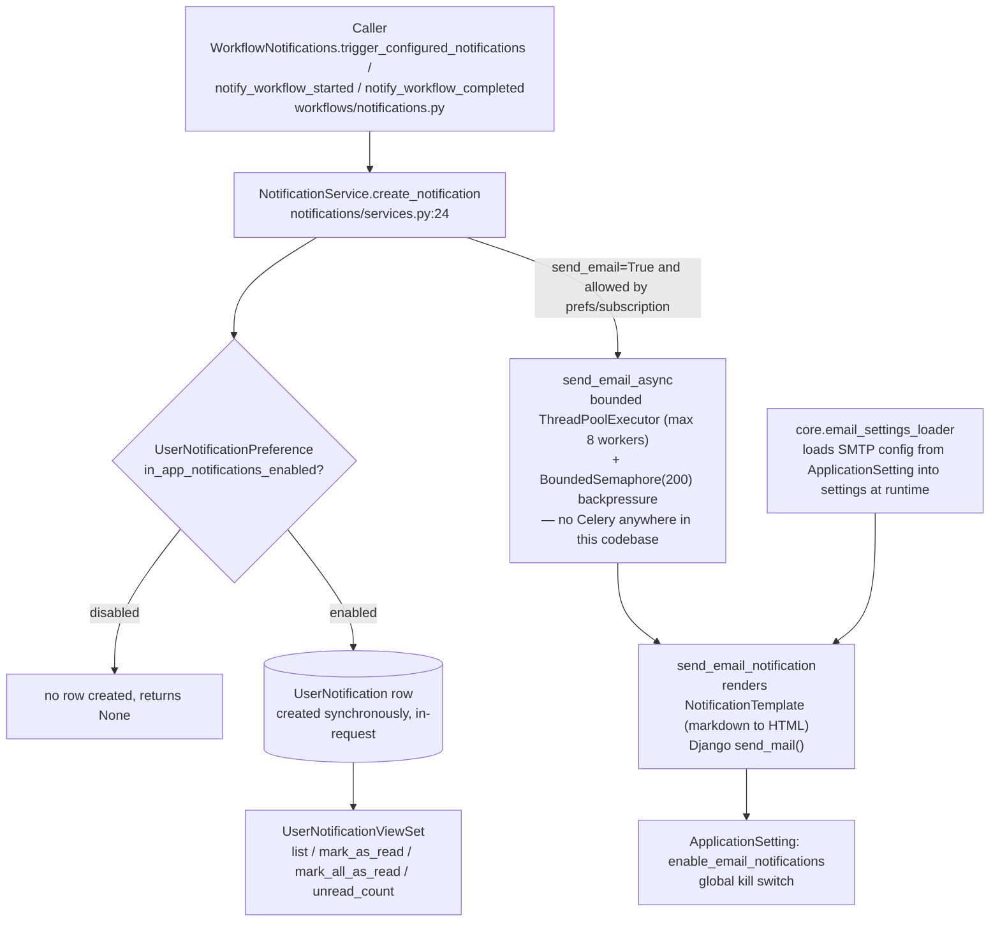

Key facts:

- The `UserNotification` DB write is synchronous, inline in the request/response cycle.
- Email is asynchronous, via a **bounded, in-process `ThreadPoolExecutor`** (`notifications/services.py` — `EMAIL_EXECUTOR_MAX_WORKERS = 8`, `EMAIL_QUEUE_MAX_SIZE = 200`), not a task queue — there is no Celery anywhere in this codebase, and this is a deliberate choice, not an oversight (see the "Notification concurrency" note below). Each pool thread closes its own DB connection in a `finally` block afterward, since it falls outside Django's `request_finished` signal.
- Submission is gated by a `threading.BoundedSemaphore(200)`: if 200 email sends are already in flight or queued, a new submission is **rejected immediately** (never blocks the calling HTTP request) and the notification is marked with `email_error = 'Email queue saturated - send dropped'` instead of silently spawning another thread.
- SMTP configuration is DB-backed (`core.email_settings_loader`), not static `settings.py` — editable via admin without an app restart.
- `WorkflowNotifications` (used throughout §7.1) is just a caller into this same `NotificationService` API — there's no separate delivery mechanism for workflow notifications specifically.

**Notification concurrency (fixed 2026-07-23, see `docs/APP_WIDE_GAPS_FIX_ROADMAP.md` Fix 7):** `send_email_async` used to spawn one raw, uncapped `threading.Thread` per email. `NotificationService.notify_role`/`notify_users` loop over recipients and call this per-user — `notify_role('HOD', ...)` with N HODs fired N concurrent unbounded threads all opening SMTP connections at once, with no backpressure and no bound. Replaced with the bounded executor + semaphore described above. This is a lighter-weight fix than adopting a full task queue (Celery/RQ/Django-Q) — deliberately, since this deployment has no broker or worker-process infrastructure today (§6), and adding one is a real infrastructure investment that should be a deliberate choice, not an inferred one. If email volume grows enough that a 200-item bounded queue starts rejecting sends regularly, that's the signal to revisit and adopt a real task queue instead of raising the constants further.

**Frontend URL trailing-slash bug (fixed 2026-07-24, see Fix 16):** `notifications.service.ts`'s `getTemplates`/`getEventTypes`/`createTemplate` built URLs without a trailing slash. Django's DRF router only matches `/api/notifications/templates/` (with slash) — the no-slash version doesn't match any `/api/*` pattern and falls through to the SPA catch-all route, silently serving the built Angular `index.html` with a `200` status. The frontend then failed to parse HTML as JSON and surfaced a generic "Failed to load" toast, which read exactly like a permission error but wasn't one — confirmed by checking `Content-Type` on the actual response, not just the status code. `workflows.service.ts` had the identical bug. Fixed by adding the trailing slash to both services' base URL constants.

**`WorkflowStepNotificationConfigViewSet` finished (fixed 2026-07-24, see Fix 17):** this per-step notification-configuration admin feature (`workflows/views_notification_config.py`) was found unregistered in any `urls.py` during the Fix 16 investigation. It wasn't just missing serializers — the whole view was written against an abandoned schema (`trigger_event`/`created_by`/`TRIGGER_EVENT_CHOICES`/M2M `recipient_roles`-`bcc_users` relations, none of which exist on the real model, which uses `event_type` + a single `recipient_types` JSONField). Rewritten against the real model, registered, gated by the same `CanManageNotifications` permission as the sibling template/event-type endpoints (previously just `IsAuthenticated`), and tested end-to-end (CRUD, `by_step`, `options`, `preview`). Also re-ran the existing, idempotent `populate_default_notification_configs` management command for real — it had only ever populated `accommodation`/`transportrequest`/`visaapplication` (20 rows); `travelrequest`/`combinedrequest` had zero, an inconsistency the user caught directly by inspecting `WorkflowStepNotificationConfig` after Fix 16. Now all 5 entity types have configs (40 rows total). **Corrected 2026-07-28 (Fix 18):** this endpoint's dedicated frontend service (`notification-config.service.ts`) genuinely has no consumer, but the earlier claim that the admin *feature* itself was unreachable was wrong — `enhanced-workflow-config.component.ts` is embedded in `system-settings.component.html`, which **is** routed (`/admin/settings`, `/settings`). Admins configure step notifications there today, through a separate write path (`WorkflowTemplateCreateSerializer.create`/`update` in `serializers.py`, which accepts a nested `notification_configs` list per step directly) rather than through this ViewSet.

**Notifications architecture audit (2026-07-28, see Fix 18):** asked directly whether notifications are fully dynamic/config-driven with no hardcoded workflow notifications. Answer: no, it's a hybrid, verified against the real call graph:
- Step assignment/approval/rejection/delegation *are* config-driven — `WorkflowEngine.process_action`/`_start_step`/`delegate_step` all call `WorkflowNotifications.trigger_configured_notifications(...)`, which checks `WorkflowStepNotificationConfig` first and only falls back to hardcoded text if no config row exists for that step/event.
- `notify_workflow_started()` (fired on every workflow start) is fully hardcoded and cannot be customized from any admin screen — there's no `workflow_started` event type in the schema for it to look up.
- Found and fixed a **duplicate-notification bug** in the same function: `_start_step()` already sends a config-driven `'assignment'` notification to the first approver; `notify_workflow_started()` ran immediately after and sent a second, hardcoded "New Approval Required" notification to the same person. Removed the redundant hardcoded send.
- `workflow_completed`/`workflow_cancelled` are hardcoded for **all 5 apps**, not just the `travelrequest`/`combinedrequest` gap Fix 17 closed — no code anywhere ever creates a config row for these two event types (`populate_default_notification_configs` and `WorkflowTemplateCreateSerializer.DEFAULT_NOTIFICATION_CONFIGS` both only cover `assignment`/`approval`/`rejection`/`delegation`). Still open — closing `workflow_cancelled` specifically needs a new `NotificationTemplate` created from scratch, since none exists yet.
- `escalation` and `reminder` event types were configurable in the admin dropdown but never fired by anything — `check_and_escalate_overdue_steps()` (the only writer of the escalation fields) was never invoked anywhere (no scheduler/cron), and its notification-send line was a literal, never-implemented `# TODO`. Asked the user directly how to handle this; **`escalation` was removed entirely** (model fields, event-type choice, audit-log action type, all frontend UI) rather than left half-built — see migration `0013_remove_workflowstep_escalation_hours_and_more.py`. `reminder` was left as-is (a template exists, `approval_reminder`, but no trigger design exists for it — a product decision, not a bug).
- Also found and removed dead code in `workflows/router.py` (`assign_step_to_role_users`/`notify_final_admin`, never called from anywhere, both broken if they had been — one called a nonexistent `WorkflowNotifications` method, the other passed a kwarg the real method doesn't accept).

See `docs/APP_WIDE_GAPS_FIX_ROADMAP.md` Fix 18 for the full investigation and fix list.

### 7.4 Reports & Insights (Read-Only Analytics)

Both apps are almost entirely **live, read-only aggregation** — no ETL, no scheduled job, no cache or materialized-view layer:

| App | Backing data | Notes |
|---|---|---|
| `reports` | `TravelRequest`, `FlightBooking`, `TransportRequest`, `VisaApplication`, `AccommodationRequest`, `WorkflowInstance`/`WorkflowStepExecution`, `User`/`Department` | No `models.py` at all — every endpoint computes stats on the fly per-request. `ReportExportView` re-runs the same query and serializes to CSV / Excel (`openpyxl`) / PDF (`reportlab`) synchronously in the request. |
| `insights` | Same models as `reports` — nothing else | `dashboard_summary`, `travel_spend_analytics`, `booking_analytics`, etc. are live queries, same pattern as `reports`. `insights/models.py` is now empty (see note below) — this app has no models of its own at all, same as `approvals` (§1). |

`reports`' 5 endpoints previously required only `IsAuthenticated` despite a `generate_admin_reports` permission existing specifically for them — any authenticated user could hit every reports endpoint. Fixed 2026-07-23 (see `docs/APP_WIDE_GAPS_FIX_ROADMAP.md` Fix 5) with a shared `_require_admin_reports_permission()` gate. Fix 9 later widened that same shared gate to also accept `export_data` (not just `generate_admin_reports`), since `ReportExportView` calls straight into the other 4 endpoints to fetch data before exporting it — an `export_data`-only holder (e.g. `Line Manager`) needs to pass the shared gate too, not just the export endpoint's own check.

`insights`' 6 endpoints split into two real categories, not one: `dashboard_summary`/`travel_spend_analytics`/`travel_pattern_analytics`/`booking_analytics` are personal, self-scoped dashboards (`IsAuthenticated` + per-user filtering via `can_view_all` — every user sees their own data, admins see everyone's), correctly left alone. `department_analytics`/`user_activity_report` are company-wide aggregates, the same class of data as `reports` — these were gated with Django's `IsAdminUser` (`is_staff`) instead of the real RBAC permission, a genuine inconsistency (`generate_admin_reports` is granted to `HOD` in this environment, `is_staff` isn't). Fixed 2026-07-23 (Fix 11): both now use the identical `_require_admin_reports_permission()` pattern as `reports`. Fixing this also surfaced 3 unrelated broken field references in the same two functions (a dead `hotel_bookings` relation from the deleted `HotelBooking` model, a nonexistent `TravelRequest.user` field/`expenses` app reference, and a `"PENDING"` vs `"Pending"` status-casing bug) — all pre-existing, undetected because both endpoints were `is_staff`-gated and never exercised by any test; fixed alongside the permission change since wiring in new access to a 500-erroring endpoint wouldn't have closed the gap.

~~`insights`' `TravelInsight`/`DestinationStat`/`CategorySpend`/`MonthlyTrend`/`TravelAnalytics` models had no population pipeline~~ — **removed entirely 2026-07-22** (see `docs/APP_WIDE_GAPS_FIX_ROADMAP.md` Fix 2), not left as dead schema. Confirmed zero rows in the DB and zero frontend callers before deleting — this wasn't "population pipeline missing," it was genuinely dead code end-to-end (backend models + viewsets + serializers, frontend service methods that were never invoked from any component). Dropped via migration rather than converted to database views or left for a future ETL, since nothing was reading or writing them.

### 7.5 Account Lifecycle

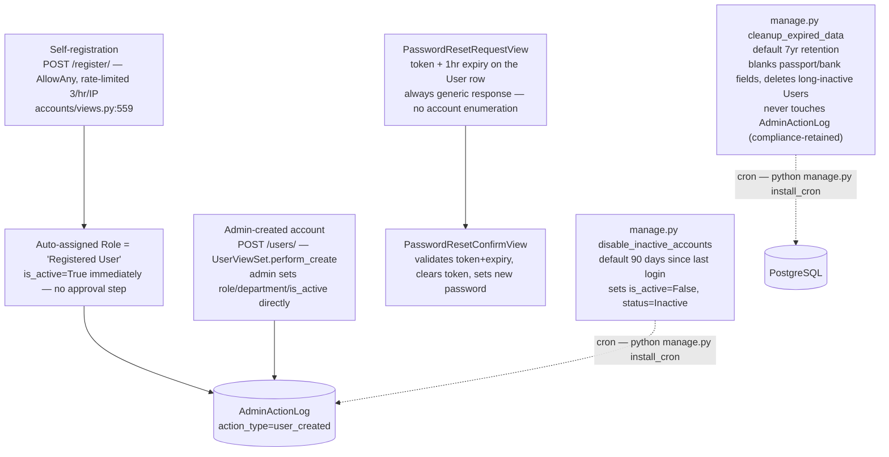

Notable: **self-registration has no approval gate at all** — a new account is active immediately, distinguished only by an auto-assigned low-privilege "Registered User" role (users cannot set their own role — it's forced server-side). `disable_inactive_accounts` and `cleanup_expired_data` are both real, tested management commands, tied to compliance controls CTRL-0000001019 and CTRL-0000001517 respectively; `python manage.py install_cron` (§6) installs their schedule directly, so a fresh deployment no longer silently skips them if an operator forgets a manual crontab copy-paste step.

### 7.6 Audit Trail Signals

`accounts/signals.py` (registered in `AccountsConfig.ready()`) is the one remaining signal module in the codebase — it's a pure observability side-channel that writes to `AdminActionLog`, with no functional/business-logic side effects on other apps:

- `pre_save`/`post_save` on `User` → diffs role/active-status changes, logs `user_activated`/`user_deactivated`/`user_role_changed`.
- `post_delete` on `User` → logs `user_deleted` (guarded against double-logging when `UserViewSet.perform_destroy` already logged it explicitly).
- `post_save`/`post_delete` on `Role` → logs `role_created`/`role_deleted`.
- `m2m_changed` on `RolePermission` → logs `role_permissions_modified`.

The four dead signal modules that used to exist in `trf`, `accommodation`, `transport`, and `visa` (§7.1) were removed as part of the approval-workflow fixes — this one is legitimate and still in use.

---

## 8. Key Dependencies

| Layer | Package | Purpose |
|---|---|---|
| Frontend | Angular 19 | SPA framework |
| Frontend | Angular Material 19 | UI components |
| Frontend | ng-bootstrap 18 | Bootstrap integration |
| Backend | Django 5 | Web framework |
| Backend | djangorestframework | REST API |
| Backend | simplejwt | JWT auth + blacklist |
| Backend | django-otp | TOTP MFA |
| Backend | cryptography (Fernet) | Field-level encryption |
| Backend | corsheaders | CORS |
| Backend | django-csp | Content-Security-Policy |
| Backend | drf-spectacular | OpenAPI schema |
| Backend | whitenoise | Static file serving |
| Backend | psycopg2 | PostgreSQL driver |
| Backend | python-crontab | Self-installing maintenance-job schedule (`manage.py install_cron`, §6) |
| Database | PostgreSQL 15 | Primary datastore |
| DevSecOps | black + isort | Python formatting |
| DevSecOps | flake8 | Python linting |
| DevSecOps | bandit | Python security scan |
| DevSecOps | ESLint + Prettier | TypeScript/HTML quality |
| DevSecOps | pre-commit | Git hook runner |
| DevSecOps | Husky + lint-staged | Frontend git hooks |
