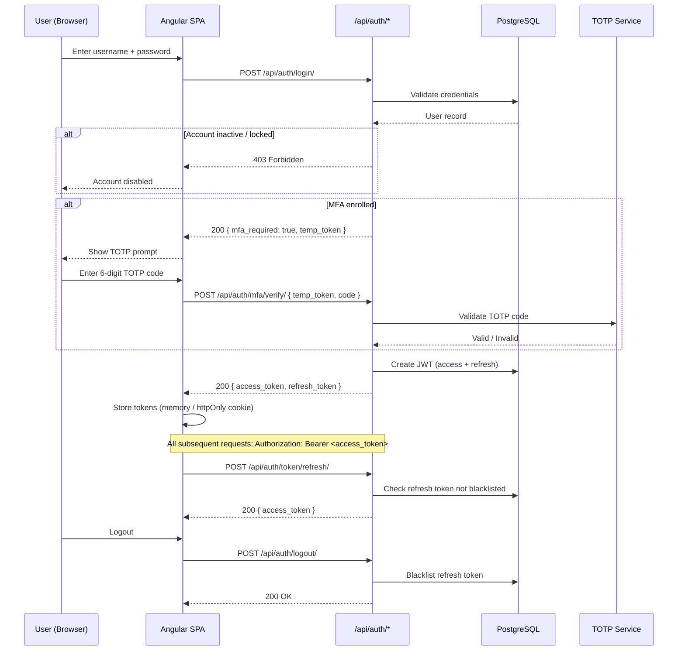
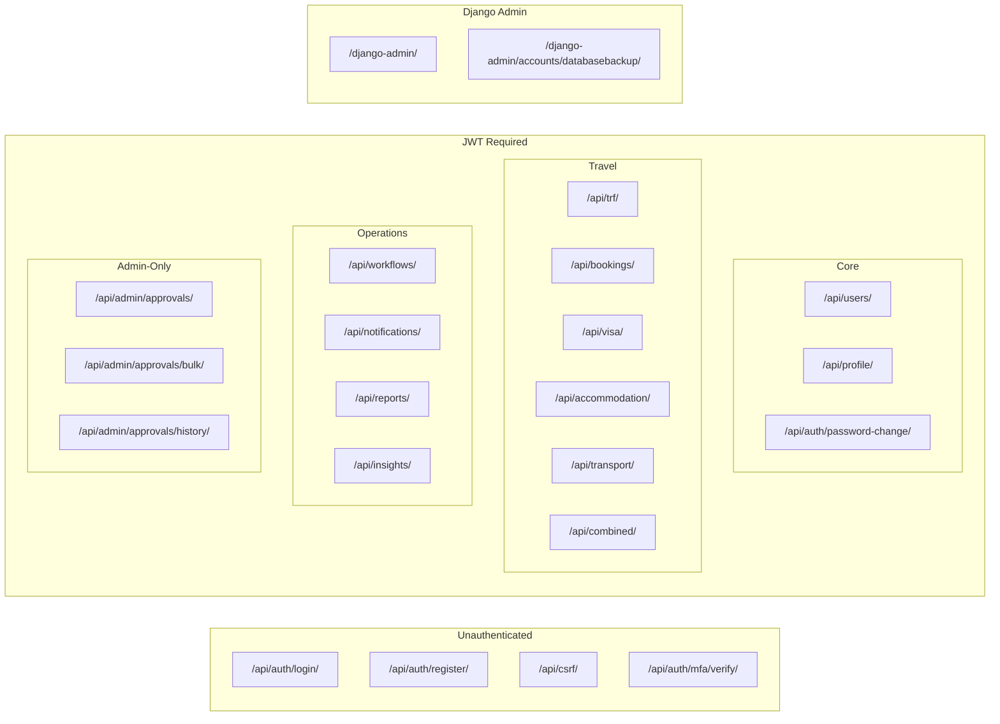
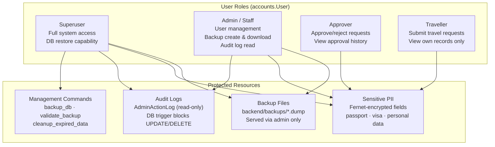
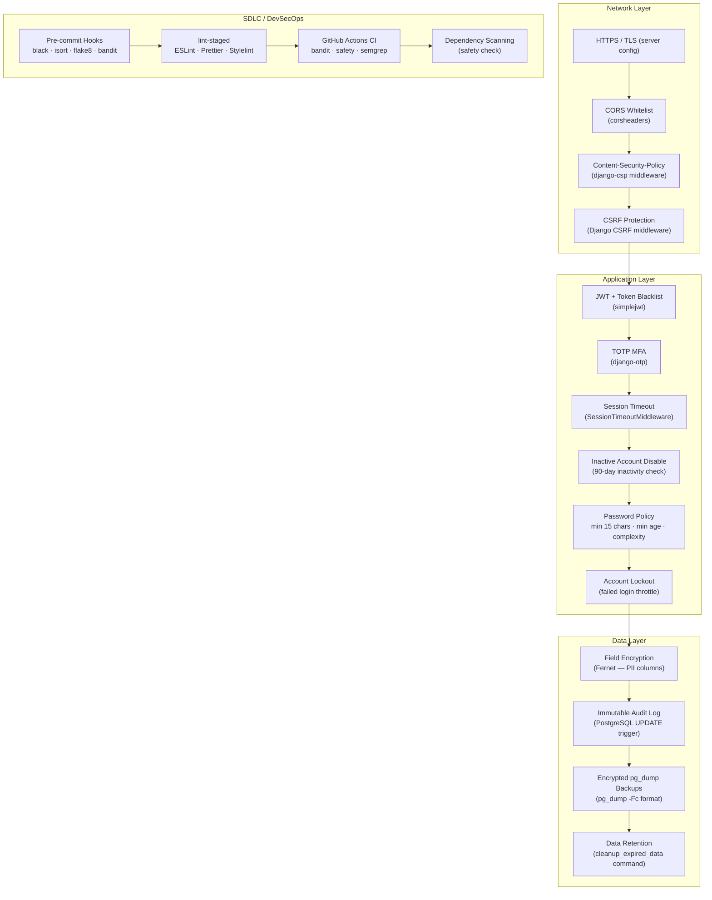
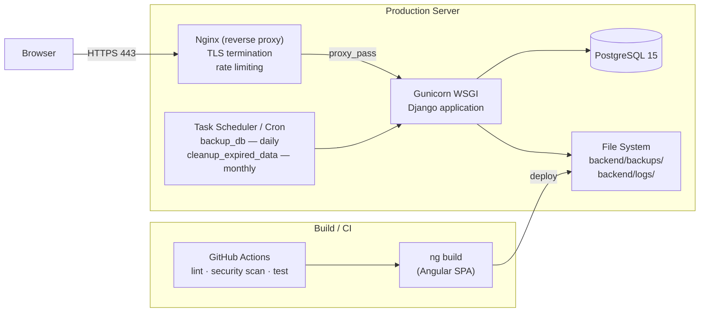
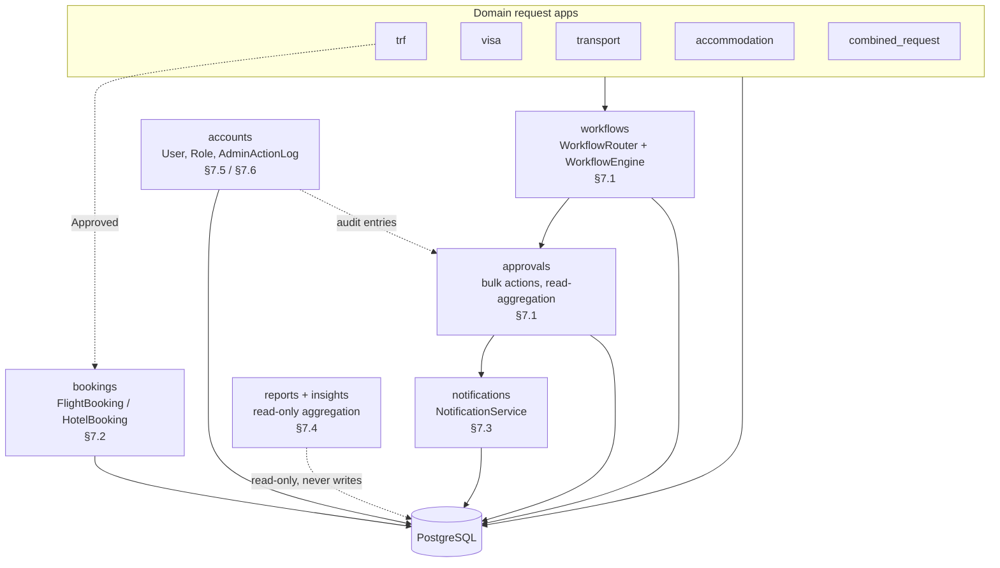
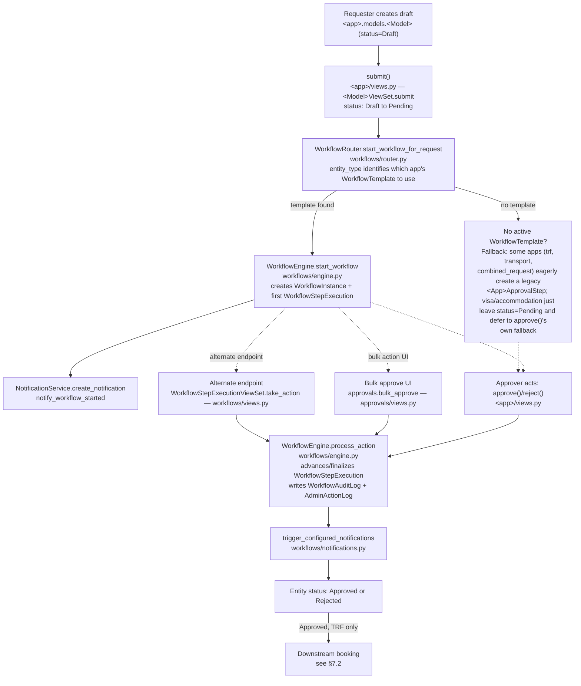
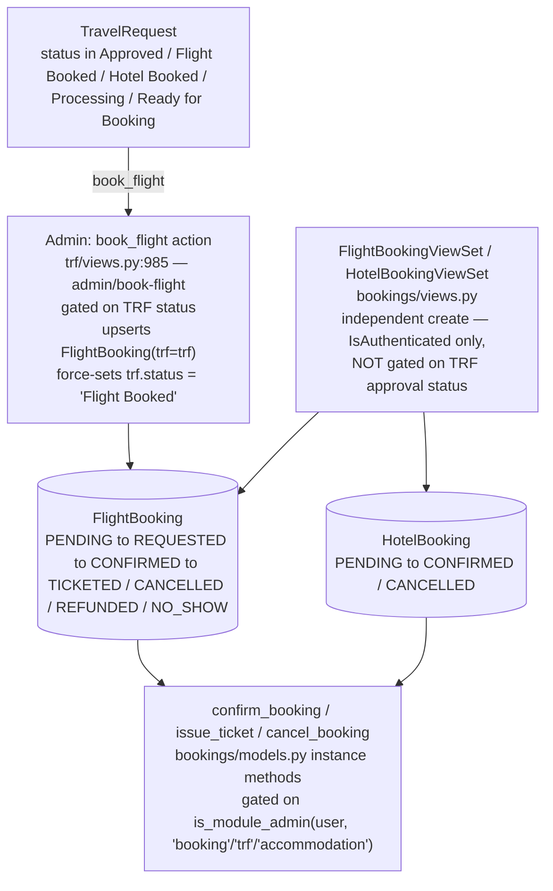
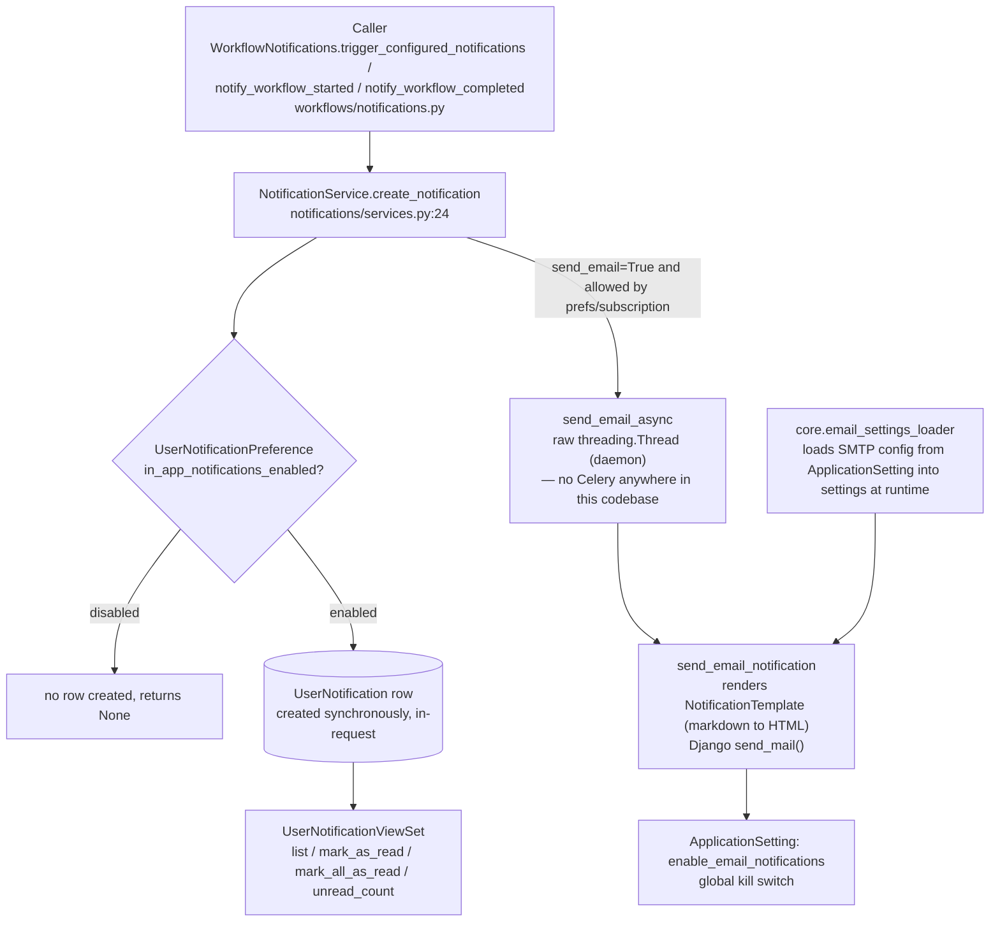
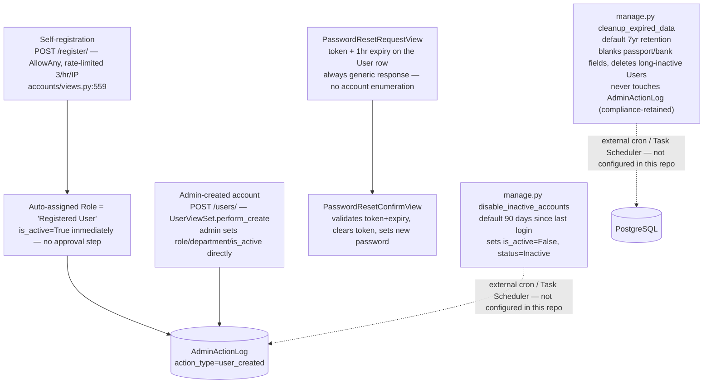

# TMS Application Architecture

Travel Management System — architecture reference for CTRL-1192.

---

## 1. System Overview

---

## 2. Authentication & MFA Flow

---

## 3. API Module Structure

---

## 4. RBAC Model

---

## 5. Security Controls Stack

---

## 6. Deployment Topology

---

## 7. Application-Wide Data Flows

This section maps how data moves through **every** domain app, not just the request/approval apps. It's organized as a bird's-eye map first, then a focused drill-down per subsystem. What's already covered elsewhere is not repeated here: authentication/MFA (§2), the API surface (§3), RBAC (§4), the security controls stack (§5), and deployment (§6).

`core/` is not a domain app in its own right — it's a single shared utility (`email_settings_loader.py`) that loads SMTP configuration from the `ApplicationSetting` table into Django settings at runtime, used by the notifications pipeline (§7.3). It has no models, views, or migrations of its own.

### 7.1 Request Submission & Approval

This is the one recurring data flow that spans five separate domain apps: **`trf`, `visa`, `transport`, `accommodation`, and `combined_request` all submit through the identical create → submit → workflow → approve/reject pipeline**, via the same shared `workflows` components (`WorkflowRouter`, `WorkflowEngine`) and the same `approvals`/notification layers. TRF was traced first because it was the app under investigation at the time, but the pattern below is generic and verified against all five apps' `views.py`, not just TRF's.

**Per-app reference:**

| App | Model | `entity_type` string | Legacy fallback model |
|---|---|---|---|
| `trf` | `TravelRequest` | `travelrequest` | `TrfApprovalStep` (created eagerly at submit) |
| `visa` | `VisaApplication` | `visaapplication` | `VisaApprovalStep` (created lazily, at approve time) |
| `transport` | `TransportRequest` | `transportrequest` | `TransportApprovalStep` (created eagerly at submit) |
| `accommodation` | `AccommodationRequest` | `accommodation` | none — status just stays `Pending` if no template |
| `combined_request` | `CombinedRequest` | `combinedrequest` | `CombinedRequestApprovalStep` (created eagerly at submit) |

`combined_request` is the multi-modal variant: its `CombinedRequest` model inlines travel/visa/accommodation/transport fields directly (with per-module inclusion flags and per-module status fields) rather than creating child records in the other four apps — but it runs through this exact same `WorkflowRouter`/`WorkflowEngine` pipeline as its own independent workflow.

All three approval entry points (single-item `approve`/`reject`, `bulk_approve`, `take_action`) converge on `WorkflowEngine.process_action` as of 2026-07-22 — see `docs/APPROVAL_WORKFLOW_FIX_ROADMAP.md` for the fix history — and this applies uniformly across all five apps, since `bulk_approve`'s `type_model_map` already covers `trf`, `transport`, `visa`, `accommodation`, and `combined`. `bulk_approve` additionally writes its own bulk-specific `AdminActionLog` entry (`workflow_bulk_approve`/`workflow_bulk_reject`) alongside the per-step entry `process_action` writes, to record that the action came from the bulk UI. `take_action`'s `delegate` branch is the one remaining exception — it's intentionally *not* routed through `WorkflowEngine.delegate_step`, because that method requires the acting user to be the step's current assignee, whereas `take_action` allows a workflow admin to delegate on someone else's behalf; consolidating it would have silently removed that admin capability.

**Resolved (2026-07-22):**

- ~~Three divergent "approve a step" code paths~~ — consolidated onto `WorkflowEngine.process_action`, application-wide (see diagram above).
- ~~Audit logging gap~~ — `WorkflowEngine.process_action` now writes an `AdminActionLog` entry for every approval path, not just bulk.
- ~~Dead signal handler~~ — deleted across all four apps that had it: `trf`, `accommodation`, `transport`, `visa` (`combined_request` never had this dead pattern).
- `approvals` app having no models is now called out directly in its module docstring and in the `APR` node label in §1 — not a bug, just previously under-documented.

**Still open, by design:**

- **Downstream requests are not auto-created on approval** — bookings, visa, accommodation, and transport records are still submitted independently by the traveller/admin after TRF approval; the only system-linked exception is the manual `book_flight` admin action. This wasn't fixed because it's a product decision (what should get prefilled, who owns the resulting draft, does the traveller review before submit), not a bug — see Fix 4 in `docs/APPROVAL_WORKFLOW_FIX_ROADMAP.md`.

### 7.2 Downstream Bookings (Flight & Hotel)

Two things worth knowing that aren't obvious from the model layer alone:

- **No `book_hotel` action exists.** `trf/views.py` has a permission check referencing a `book_hotel` action name (line 270), but grep confirms no `@action def book_hotel` was ever implemented — hotel bookings can only be created through `bookings`' own endpoint, with no TRF-approval linkage at all.
- **Gap:** `book_flight` enforces the TRF's status before creating/updating a `FlightBooking`. The `bookings` app's own `POST /api/bookings/flights/` and `/hotels/` do not — they only require `IsAuthenticated`, with no check that the referenced TRF is even approved. Any authenticated user can create a booking against any `trf` id directly, bypassing `book_flight`'s gating entirely. This is a real, currently-undocumented inconsistency, not a deliberate design choice as far as the code shows.

### 7.3 Notifications Delivery Pipeline

Key facts:

- The `UserNotification` DB write is synchronous, inline in the request/response cycle.
- Email is asynchronous, but via a **raw background `threading.Thread`**, not a task queue — there is no Celery anywhere in this codebase. The thread explicitly closes its own DB connection in a `finally` block afterward, since it falls outside Django's `request_finished` signal.
- SMTP configuration is DB-backed (`core.email_settings_loader`), not static `settings.py` — editable via admin without an app restart.
- `WorkflowNotifications` (used throughout §7.1) is just a caller into this same `NotificationService` API — there's no separate delivery mechanism for workflow notifications specifically.

### 7.4 Reports & Insights (Read-Only Analytics)

Both apps are almost entirely **live, read-only aggregation** — no ETL, no scheduled job, no cache or materialized-view layer:

| App | Backing data | Notes |
|---|---|---|
| `reports` | `TravelRequest`, `FlightBooking`/`HotelBooking`, `TransportRequest`, `VisaApplication`, `AccommodationRequest`, `WorkflowInstance`/`WorkflowStepExecution`, `User`/`Department` | No `models.py` at all — every endpoint computes stats on the fly per-request. `ReportExportView` re-runs the same query and serializes to CSV / Excel (`openpyxl`) / PDF (`reportlab`) synchronously in the request. |
| `insights` | Same models as `reports`, plus its own `TravelInsight`/`DestinationStat`/`CategorySpend`/`MonthlyTrend`/`TravelAnalytics` models | `dashboard_summary`, `travel_spend_analytics`, `booking_analytics`, etc. are live queries exactly like `reports`. **But** the dedicated analytics models (`DestinationStat`, `CategorySpend`, `MonthlyTrend`, `TravelAnalytics`) have no population pipeline anywhere in the codebase — no management command, signal, or scheduled task writes to them. `TravelInsight` rows are created directly by users via the API, not computed. Treat this half of `insights` as a **dormant, unwired stub**, not a working analytics pipeline. |

### 7.5 Account Lifecycle

Notable: **self-registration has no approval gate at all** — a new account is active immediately, distinguished only by an auto-assigned low-privilege "Registered User" role (users cannot set their own role — it's forced server-side). `disable_inactive_accounts` and `cleanup_expired_data` are both real, tested management commands, but **neither is scheduled anywhere in this repository** — their docstrings say to run them "via cron or Task Scheduler," implying an external, undocumented-in-code schedule that whoever operates this deployment needs to have set up separately.

### 7.6 Audit Trail Signals

`accounts/signals.py` (registered in `AccountsConfig.ready()`) is the one remaining signal module in the codebase — it's a pure observability side-channel that writes to `AdminActionLog`, with no functional/business-logic side effects on other apps:

- `pre_save`/`post_save` on `User` → diffs role/active-status changes, logs `user_activated`/`user_deactivated`/`user_role_changed`.
- `post_delete` on `User` → logs `user_deleted` (guarded against double-logging when `UserViewSet.perform_destroy` already logged it explicitly).
- `post_save`/`post_delete` on `Role` → logs `role_created`/`role_deleted`.
- `m2m_changed` on `RolePermission` → logs `role_permissions_modified`.

The four dead signal modules that used to exist in `trf`, `accommodation`, `transport`, and `visa` (§7.1) were removed as part of the approval-workflow fixes — this one is legitimate and still in use.

---

## 8. Key Dependencies

| Layer | Package | Purpose |
|---|---|---|
| Frontend | Angular 19 | SPA framework |
| Frontend | Angular Material 19 | UI components |
| Frontend | ng-bootstrap 18 | Bootstrap integration |
| Backend | Django 5 | Web framework |
| Backend | djangorestframework | REST API |
| Backend | simplejwt | JWT auth + blacklist |
| Backend | django-otp | TOTP MFA |
| Backend | cryptography (Fernet) | Field-level encryption |
| Backend | corsheaders | CORS |
| Backend | django-csp | Content-Security-Policy |
| Backend | drf-spectacular | OpenAPI schema |
| Backend | whitenoise | Static file serving |
| Backend | psycopg2 | PostgreSQL driver |
| Database | PostgreSQL 15 | Primary datastore |
| DevSecOps | black + isort | Python formatting |
| DevSecOps | flake8 | Python linting |
| DevSecOps | bandit | Python security scan |
| DevSecOps | ESLint + Prettier | TypeScript/HTML quality |
| DevSecOps | pre-commit | Git hook runner |
| DevSecOps | Husky + lint-staged | Frontend git hooks |
